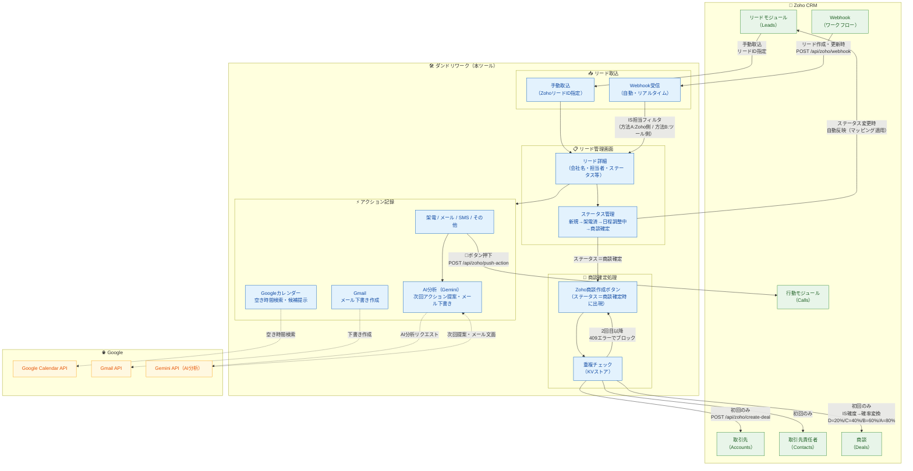

# Zoho CRM × ダンドリワーク 連携運用フロー

作成日：2026-03-31

---

## 全体フロー図



---

## 運用ステップ（5段階）

### ① Zoho でリード登録

Zoho CRM のリードモジュールに新規顧客情報を登録する。

- メインIS担当フィールドに担当者を設定する
- Webhook が設定済みであれば、登録と同時にダンドリワークへ自動通知される

---

### ② ダンドリワークでリード受信

| 取込方法 | 操作 | タイミング |
|---------|------|----------|
| **自動（Webhook）** | 操作不要 | Zoho でリード登録・更新時に即時 |
| **手動** | ZohoリードIDを入力して取込ボタンを押す | 任意のタイミング |

**IS担当フィルタ（Webhook使用時）**

全リードではなく特定IS担当者のみ連携したい場合：

- **推奨：方法A**（Zohoワークフローの条件設定でフィルタ）
- **代替：方法B**（ツール側で受信後に判定）

---

### ③ IS担当がアクションを記録する

架電・メール・SMS・その他のアクションを記録する。記録後に以下の機能が使用できる。

#### AI分析（Gemini）

- 通話メモをもとに次回アクションを提案
- フォローアップのトーク内容を生成
- メール文面を自動下書き

#### Googleカレンダー連携

- チームメンバーの空き時間を横断検索
- 候補日時を自動提示

#### Gmailメール送信

- テンプレートに変数（`{{担当者名}}`・`{{候補日時}}`等）を展開して下書き作成

#### Zohoへのアクション履歴登録

- アクション記録後の **🔗ボタン** を押すと、Zoho の行動（Calls）モジュールに自動登録される

| Zoho Calls フィールド | 登録内容 |
|--------------------|---------|
| 件名 | `電話）インバウンド`（固定） |
| 開始日時 | アクション日時 |
| 活動目的 | `追客`（固定） |
| 説明 | アクション内容・結果・次回アクション情報 |
| 電話種別 | `Inbound`（固定） |

---

### ④ ステータス変更 → Zoho に自動反映

ダンドリワーク上でステータスを変更すると、Zoho CRM のリードステータスに自動で反映される。

**ステータスの流れ**

```
新規 → 架電済 → 日程調整中 → 商談確定
```

**マッピング例**

| ダンドリワーク | Zoho CRM |
|-------------|---------|
| 新規 | New |
| 架電済 | Attempted to Contact |
| 日程調整中 | Appointment Scheduled |
| 商談確定 | （Zoho側の表記に合わせて設定） |

> ステータス名が同じ場合はマッピング設定不要。

---

### ⑤ 商談確定 → Zoho に一括作成

ステータスが「商談確定」になると、リード詳細画面に **🔗 Zoho商談作成** ボタンが出現する。

ボタンを押すと以下の3レコードをZohoに一括作成する。

| 作成レコード | 元データ |
|-----------|---------|
| **取引先（Account）** | 会社名・HP URL |
| **取引先責任者（Contact）** | 担当者名・メールアドレス |
| **商談（Deal）** | リードタイプ（商談名）・IS確度→確率・商談日 |

**IS確度と確率の変換**

| IS確度 | Zoho 確率 |
|-------|---------|
| D | 20% |
| C | 40% |
| B | 60% |
| A | 80% |

**重複作成の防止**

```
🔗 Zoho商談作成ボタンを押す
        ↓
サーバーが KVストア を確認
        ↓
  ┌── zoho_deal_id が保存済み
  │       → 409エラーでブロック
  │       → 「ℹ️ この商談はすでにZohoに作成済みです」と表示
  │
  └── zoho_deal_id なし → 取引先・取引先責任者・商談を作成
              ↓
        KV に zoho_deal_id を即時保存
              ↓
        「✅ Zohoに取引先・取引先責任者・商談を作成しました」と表示
```

---

## データ連携サマリ

| 方向 | タイミング | 内容 |
|------|----------|------|
| Zoho → ツール | リード登録・更新時（自動）or 手動 | 会社名・担当者・ステータス・IS担当 等 |
| ツール → Zoho | アクション記録後（手動 🔗） | 架電履歴を Calls として登録 |
| ツール → Zoho | ステータス変更時（自動） | リードのステータスを同期 |
| ツール → Zoho | 商談確定時（手動ボタン） | 取引先・取引先責任者・商談を一括作成 |

---

## 注意事項

- Zoho連携が有効なのは `zoho_lead_id` が設定されているリードのみ（Zohoから取り込んだリード）
- アクセストークンは1時間で失効するが、リフレッシュトークンで自動更新される（再認証不要）
- Client Secret はセキュリティのためサーバー側のみに保存され、画面には表示されない
- 商談の重複作成はサーバー側でブロックされるため、ボタンを複数回押しても安全
